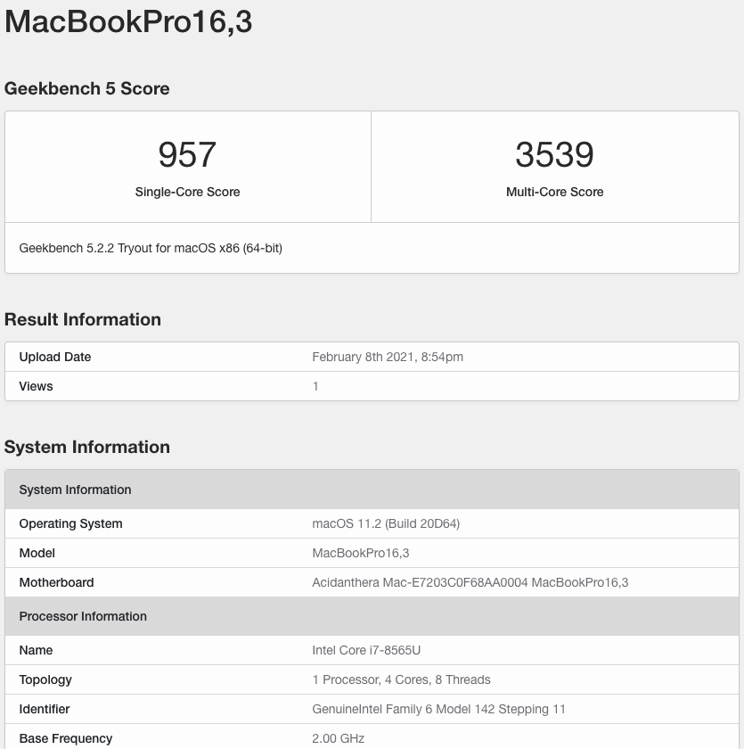

# Hackintosh for HP Spectre-X360-13 late 2018

Please check https://github.com/jpuxdev/HP-Spectre-X360-13-Early-2019-Hackintosh first ! This repo learns a lot from it.

> If your trackpad doesn't work suddenly, hit `prt sc` key may help

两个版本：
* Catalina Clover：基于 clover，支持 macOS 10.15.7 基本完美
* Big Sur Opencore：基于 opencore，支持 Big Sur 11.2，4k 外接屏 60hz 可能无法使用

Two Versions:
* Catalina Clover：based on clover，supports macOS Catalina 10.15.7
* Big Sur Opencore：based on opencore，supports macOS Big Sur 11.2.
  * **The external 4k screen may not works at 60hz with unusable flash**
  * Not sure whether others will meet this or not: After copying the EFI to internal SSD EFI partition, it will stuck at [EB|#LOG:EXITBS:START]. However, it works fine if booting from USB EFI partition.
  
> **For Big Sur**: When you boot the system with an external monitor, the internal 4k screen doesn't look like 60hz -- It may behave like around 40hz(Though the system reports as 60hz screen). It could be solved by booting without external monitor or re-pluging the external monitor.

> **For Big Sur**: When you unplug the external screen for the first time after booting, the internal screen may turn into black. You should close the lid and unplug the external screen after the internal screen stops working. Then open the lid, and the internal screen should work fine. The operation is only needed for the first time, unless you reboot the system.

------

Patch your DSDT as shown in [tonymacx86](https://www.tonymacx86.com/threads/guide-hp-spectre-x360-13-ap0037tu-late-2018.295518/):

* [bat]HP_Spectre_x360_apxxxx.txt ( Catalina Clover + Big Sur Opencore)
* [I2C]HP_Spectre_x360_apxxxx.txt ( Big Sur Opencore ONLY ) ==> This will fix your trackpad with opencore. Not needed with clover

------

### Improve the performance by undervoltage !

You could notice your CPU frequency drops to 600mhz when using an application that consumes GPU heavily (such as Epic Game Launcher), or you get lower mark with GeekBench5 when comparing to Windows 10. Then [voltageshfit](https://github.com/sicreative/VoltageShift) is all your need !

According to my insufficient test, `sudo ./voltageshift --damage offset -100 -100 -100` works good ! (CPU, GPU, and CPU Cache). It is possible to set CPU and CPU Cache to -125, but the computer has the risk of overheating shutdown since the fan cannot work at full speed in time.

* Before voltageshfit, GeekBench5 gives me about 900~1000 single core, 2900~3000 multi-core; CPU runs at 600mhz when opening Epic Game Launcher
* After voltageshfit, GeekBench5 gives me about 900-1000 single core, 3300~3400 multi-core; CPU works normally when opening Epic Game Launcher

> Please spend more time on adjusting the parameters ! It is important to make sure the values cannot give you an unstable system :)

My radical parameters: `sudo ./voltageshift --damage offset -120 -500 -120`, and the GeekBench5 score below:

 

------

### More thoughts about the performance

There are still more problems with the performance, especially when using an application consuming GPU heavily(Games). Though undervoltage could alleviate it, 800mhz CPU still occurs when CPU package power meets 15w more than 20 seconds(Games again. I even cannot play MTGA smoothly). I guess 15w is the main reason since it works well before CPU package power drops below 15w (only for several seconds), and CPU frequency drops after CPU package power is limited below 15w. So I think 20w TDP could solve this problem.

However, I have noticed that the TDP is 15w even if the PL1/PL2 are set to 20w/30w (PL1/PL2 are the default values). 

When in windows, the TDP are set to 20w on performance mode and 7w on cooling mode (HP Command Center does the trick, and all the values could be seen in XTU) while the PL1/PL2 keep 20w/30w.

I guess if we want to improve the performance, we need to figure out how the HP Command Center works :)

Please help if you have any ideas or solutions :)
